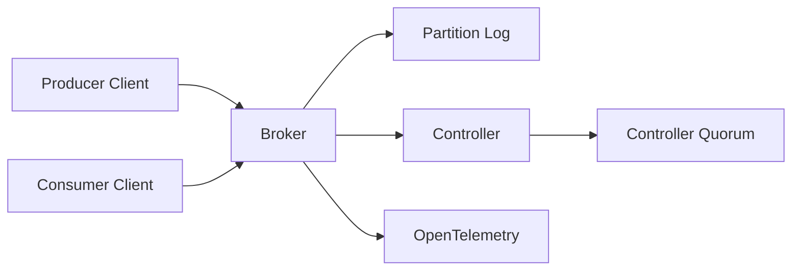

# StellFlow Service

`stellflow-service` 是 StellHub 体系中的分布式消息队列服务端项目。它保留 Topic、Partition、Replica、ISR、Offset、Controller Quorum 等消息队列核心语义，并采用更现代的 Java、Netty、gRPC、Raft 与 OpenTelemetry 工程路线实现。

## 项目概述

StellFlow 的定位是基础设施级消息系统，不是对某个开源项目的逐行复刻。它的目标是构建一套可学习、可演进、可观测、可控制的消息队列服务端，为 StellHub 体系中的日志、事件和异步任务链路提供基础能力。

## 当前状态

| 项目 | 说明 |
| --- | --- |
| 稳定性 | 开发中 |
| 服务类型 | 分布式消息队列服务端 |
| 推荐运行时 | JDK 25 |
| 通信模型 | 自定义协议、Netty、gRPC 控制面 |
| 一致性模型 | Raft Controller Quorum |
| 可观测性 | OpenTelemetry-first |
| 维护方 | StellHub |

## 解决什么问题

- 提供 Topic / Partition / Replica 模型。
- 支持面向高吞吐写入的分布式日志存储。
- 支持 Broker、Controller、Client 等基础运行角色。
- 支持分区复制、消费位点和控制面一致性。
- 为日志链路、事件链路和异步消息提供统一底座。

## 不解决什么问题

- 不作为 Kafka 原始实现的逐项复刻。
- 不承诺兼容 Kafka 二进制协议。
- 不直接提供业务工作流编排。
- 不替代数据库或通用 KV 存储。

## 核心能力

| 能力 | 说明 | 典型场景 |
| --- | --- | --- |
| Topic 管理 | 组织消息逻辑主题 | 日志、事件、任务分流 |
| Partition | 提供分区并行能力 | 高吞吐写入和消费 |
| Replica | 分区副本复制 | 高可用 |
| Offset | 消费进度管理 | 消费恢复 |
| Controller | 管理集群元数据 | 分区调度、故障恢复 |
| Observability | OpenTelemetry 指标与链路 | 运维排查 |

## 架构说明



## 快速开始

```bash
mvn clean test
mvn clean package -DskipTests
```

本地运行方式以仓库内 `cmd`、`scripts` 或 `docs` 中的启动说明为准。

## 配置说明

| 配置项 | 是否必填 | 说明 |
| --- | --- | --- |
| broker.id | 是 | Broker 节点 ID |
| broker.host | 是 | Broker 对外地址 |
| broker.port | 是 | Broker 监听端口 |
| controller.quorum | 是 | Controller 节点列表 |
| log.dirs | 是 | 分区日志存储目录 |
| telemetry.enabled | 否 | 是否开启可观测性上报 |

## 本地开发

```bash
mvn clean verify
```

涉及协议、日志存储、复制、选主、位点和控制面元数据的改动必须补充测试。

## 版本与升级

- `MAJOR`：不兼容协议、存储格式或集群元数据变更。
- `MINOR`：向后兼容的新能力。
- `PATCH`：向后兼容的问题修复。

## 可观测性

| 类型 | 名称 | 说明 |
| --- | --- | --- |
| Metric | stellflow_broker_request_total | Broker 请求总数 |
| Metric | stellflow_partition_lag | 分区复制滞后 |
| Metric | stellflow_controller_leader_changes_total | Controller Leader 变更次数 |
| Log | BROKER_STARTED | Broker 启动 |
| Log | PARTITION_REASSIGNED | 分区重新分配 |

## 故障排查

### Producer 写入失败

1. 检查 Broker 是否启动。
2. 检查 Topic 和 Partition 是否存在。
3. 检查 Controller 是否可用。
4. 检查日志目录是否可写。

### Consumer 无法消费

1. 检查消费位点是否正确。
2. 检查目标分区是否存在可用副本。
3. 检查 Broker 与客户端协议版本是否匹配。

## 安全说明

- 生产环境配置不应直接提交到仓库。
- 管理端口和内部通信端口应限制访问范围。
- 数据目录需要按生产规范配置磁盘、权限和备份策略。

## 目录结构

```text
.
├── src/            # 服务源码
├── docs/           # 设计与运维文档
├── scripts/        # 构建和启动脚本
├── pom.xml         # Maven 构建文件
└── README.md       # 项目说明
```

## 贡献规范

- 协议、存储格式、复制语义变更必须先写设计说明。
- 核心链路变更必须补充测试。
- 行为变更必须同步更新 README 或 docs。

## 支持

由 StellHub 维护。建议通过 GitHub Issues 记录问题、需求和设计讨论。

## 许可证

以仓库内 `LICENSE` 文件为准。