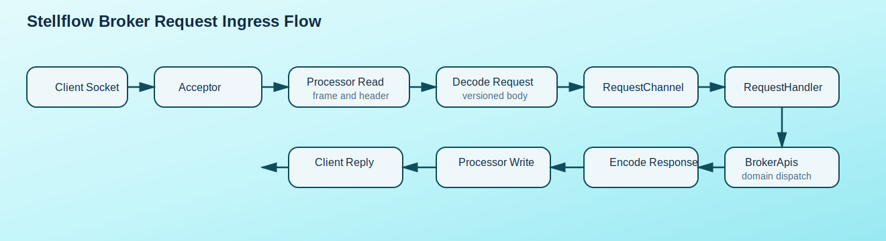
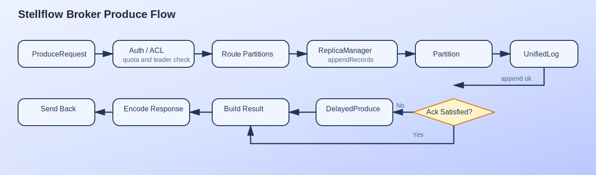
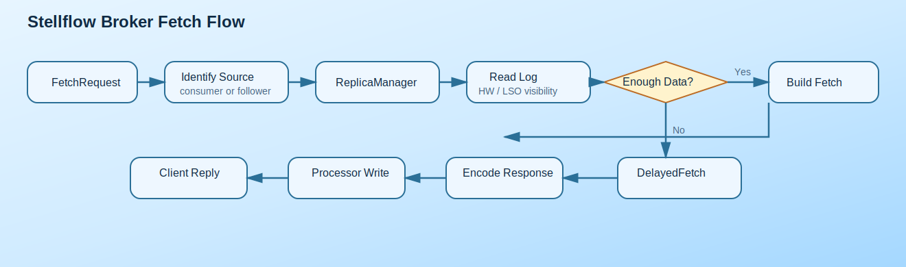

# Stellflow Broker 请求处理链路设计

## 1. 文档目标

本文档定义 `stellflow` Broker 从网络接入、请求解码、权限校验、业务分发到响应回写的完整处理链路，作为 `network`、`server`、`replica`、`coordinator` 等模块联调的设计依据。

本设计目标是尽量保持 Kafka Broker 的工程思想一致：网络层轻量、请求统一建模、业务分层清晰、热点路径批处理优先、异步回写与配额控制内聚。

## 2. 设计目标

### 2.1 功能目标

- 支持统一请求入口与版本化协议分发
- 支持 Produce、Fetch、Metadata、ListOffsets、OffsetCommit 等核心请求
- 支持认证、鉴权、限流、连接管理
- 支持同步与异步业务处理共存
- 支持请求指标采集与错误码统一返回

### 2.2 非功能目标

- I/O 线程不承载重业务逻辑
- 请求对象生命周期清晰，避免过度复制
- 业务线程池可按负载横向扩展
- 慢请求不阻塞网络收包

## 3. 整体链路概览

### 3.1 请求主链路



Broker 请求总链路可划分为 8 个阶段：

1. 连接建立
2. 网络读事件触发
3. 请求帧读取与头部解析
4. 协议对象反序列化
5. 请求入队到 `RequestChannel`
6. 业务线程处理
7. 响应对象编码
8. 网络线程异步回写

### 3.2 分层原则

- `network` 层只做连接、字节缓冲、协议编解码、回写调度
- `server` 层负责路由、上下文组装、统一异常处理
- `replica`、`coordinator`、`metadata` 等领域层负责业务语义
- 响应必须回到网络层统一发送

## 4. 核心组件设计

### 4.1 SocketServer

职责：

- 启动监听端口
- 管理 Acceptor 和 Network Processor 线程
- 维护连接上下文与通道状态
- 把完整请求放入 `RequestChannel`
- 接收待发送响应并写回

建议拆分为：

- `SocketServer`
- `Acceptor`
- `Processor`
- `ConnectionContext`
- `Send` / `Receive`

### 4.2 RequestChannel

`RequestChannel` 是网络层和业务层之间的解耦总线，建议包含：

- 请求队列
- 响应队列
- 请求完成监听器
- 指标采样点

设计要求：

- 支持多生产者、多消费者
- 支持按处理器维度回传响应
- 支持超时与关闭时的安全清理

### 4.3 KafkaApis 对应入口

在 `stellflow` 中建议保留同等职责入口，例如：

- `BrokerApis`
- `RequestDispatcher`
- `RequestContext`

职责：

- 根据 `ApiKey + version` 路由请求
- 调用鉴权、配额与各领域服务
- 将领域结果映射为协议响应

### 4.4 领域服务

建议依赖以下服务对象：

- `ReplicaManager`
- `MetadataCache`
- `GroupCoordinator`
- `TxnCoordinator`
- `AutoTopicCreationManager`
- `QuotaManager`
- `Authorizer`

## 5. 线程模型设计

### 5.1 线程角色

- `Acceptor`：只负责接受新连接
- `Processor`：负责非阻塞读写与请求帧拼装
- `RequestHandler`：负责业务处理
- `Background`：负责过期连接、配额刷新、指标上报

### 5.2 线程协作原则

- `Processor` 不直接执行重业务逻辑
- `RequestHandler` 不直接操作底层 Selector
- 响应发送由原始 `Processor` 或指定回写线程完成
- 对长轮询请求采用延迟完成模型，而不是阻塞线程等待

## 6. 请求对象模型设计

### 6.1 请求上下文

建议定义 `RequestContext`，至少包含：

- `connectionId`
- `clientId`
- `traceId`
- `spanId`
- `tenantId`
- `quotaKey`
- `authContextId`
- `trafficClass`
- `trafficTag`
- `listenerName`
- `securityProtocol`
- `principal`
- `apiKey`
- `apiVersion`
- `correlationId`
- `requestHeader`
- `requestBody`
- `receivedTimeMs`

### 6.2 响应对象

建议定义：

- `ResponseContext`
- `ResponseBody`
- `ResponseSend`

响应必须携带：

- `correlationId`
- 错误码
- 节流时间
- 业务结果载荷

### 6.3 错误映射

统一由异常映射器将领域异常映射为协议错误码，例如：

- 认证失败
- 未授权
- 不存在的 Topic 或 Partition
- 非 Leader 写入
- 位移越界
- 配额超限

## 7. 请求分类设计

### 7.1 快路径请求

快路径请求可以直接由领域服务同步返回：

- `ApiVersions`
- `Metadata`
- `FindCoordinator`
- `OffsetFetch`

### 7.2 慢路径请求

慢路径请求可能涉及磁盘、复制或延迟完成：

- `Produce`
- `Fetch`
- `ListOffsets`
- `OffsetCommit`
- `Txn` 相关请求

### 7.3 延迟完成请求

以下请求建议进入延迟操作管理器：

- 长轮询 `Fetch`
- 需要满足副本 ACK 条件的 `Produce`
- Group 协调中的等待类请求

## 8. Produce 请求处理设计

### 8.1 处理流程



处理步骤：

1. 网络层完成 `ProduceRequest` 解码。
2. `BrokerApis` 校验版本、认证和鉴权。
3. 校验 Topic、Partition 和目标 Leader 身份。
4. 执行消息大小、配额和格式校验。
5. 按分区将批次交给 `ReplicaManager.appendRecords`。
6. `ReplicaManager` 调用对应 `Partition` 和 `UnifiedLog` 完成追加。
7. 根据 `acks` 与 `min.insync.replicas` 决定立即响应或延迟完成。
8. 构造分区级结果并聚合成 `ProduceResponse`。
9. 响应入队，网络层异步回写。

### 8.2 关键设计点

- 同一请求中的多个分区结果必须逐分区返回
- 不允许一个分区失败导致整个请求直接丢失其他结果
- 延迟 ACK 必须由 `DelayedProduce` 驱动，而不是阻塞业务线程

## 9. Fetch 请求处理设计

### 9.1 处理流程



处理步骤：

1. 解码 `FetchRequest` 并识别请求来源。
2. 校验是否为普通消费者、Follower 副本或其他内部角色。
3. 读取 `MetadataCache` 和分区运行状态。
4. 调用 `ReplicaManager.fetchMessages`。
5. 对普通消费者按高水位或最后稳定偏移量控制可见性。
6. 若无足够数据且允许长轮询，则注册 `DelayedFetch`。
7. 数据可返回时构造分区级 `FetchResponseData`。
8. 聚合响应后异步回写。

### 9.2 关键设计点

- 普通消费与副本同步必须分开处理读可见性
- 长轮询请求不能长期占用业务线程
- 单个慢分区不能拖垮整个响应拼装过程

## 10. Metadata 与协调类请求设计

### 10.1 Metadata 请求

流程特点：

- 先读本地 `MetadataCache`
- 必要时触发自动建 Topic 流程
- 构造按版本裁剪后的元数据响应

### 10.2 OffsetCommit / OffsetFetch

协调类请求由 `GroupCoordinator` 负责：

- 查找目标协调器分区
- 校验组状态与代次
- 写入位点日志或状态存储
- 返回按分区汇总的处理结果

## 11. 延迟操作设计

### 11.1 DelayedOperationPurgatory

建议保留与 Kafka 一致的思想，使用延迟操作容器管理以下等待：

- `DelayedProduce`
- `DelayedFetch`
- `DelayedJoin`
- `DelayedHeartbeat`

### 11.2 通知机制

当以下事件发生时，应主动尝试完成等待请求：

- 高水位推进
- 新数据追加
- ISR 变化
- Group 状态变化
- 超时到达

## 12. 配额与安全设计

### 12.1 安全链路

建议请求链路中按顺序处理：

1. 连接认证
2. 请求级鉴权
3. 资源级 ACL 校验
4. 审计记录

### 12.2 配额链路

建议对以下维度做配额控制：

- Producer 字节速率
- Consumer 字节速率
- 请求速率
- Controller 或复制内部流量预留

配额超限后：

- 可以延迟响应
- 也可以直接返回节流时间提示

## 13. 指标与日志埋点

建议在以下节点埋点：

- 请求接收数
- 解码失败数
- 鉴权失败数
- 各 API 平均延迟与 P99
- 请求队列长度
- 响应队列长度
- 延迟操作数量
- 长轮询命中率

日志建议覆盖：

- 连接建立与关闭
- 认证失败
- 超时请求
- 大请求与慢请求
- 非 Leader 写入等常见错误

## 14. 包结构建议

```text
io.github.stellhub.stellflow.network
io.github.stellhub.stellflow.network.protocol
io.github.stellhub.stellflow.network.transport
io.github.stellhub.stellflow.server
io.github.stellhub.stellflow.server.api
io.github.stellhub.stellflow.server.delayed
```

## 15. 一期实现顺序

1. `SocketServer`、`Acceptor`、`Processor`
2. `RequestChannel`
3. `RequestContext` 与协议分发器
4. `BrokerApis`
5. `Produce` 与 `Fetch` 两条主链路
6. 延迟操作与配额控制

## 16. 结论

Broker 请求处理链路的核心不是“把请求送到某个方法里”，而是建立一个可控、可扩展、低耦合的请求执行通道。只要 `SocketServer -> RequestChannel -> BrokerApis -> Domain Service -> Async Response` 这条主骨架稳定下来，后续无论接入更多 API，还是接入复制、事务、协调器，都能自然扩展。
