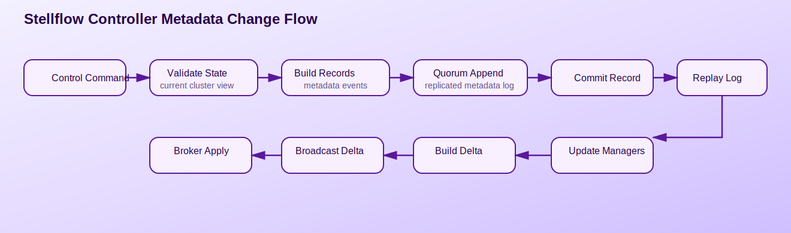
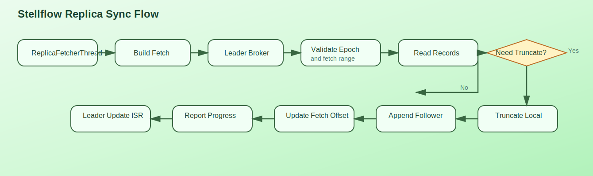
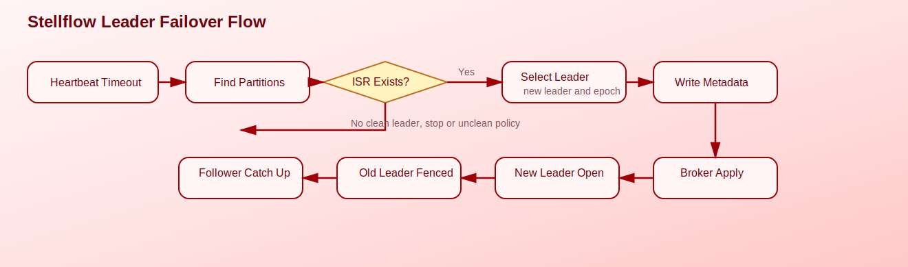

# Stellflow Controller 与 Replica 详细设计

## 1. 文档目标

本文档定义 `stellflow` 控制面与复制子系统的详细设计，包括元数据日志、控制器状态机、Broker 注册、分区领导者管理、副本同步、高水位推进和故障切换流程。

Controller 与 Replica 是整个集群正确性的关键。控制器决定“谁应该做什么”，复制子系统决定“数据是否真的一致”。这两部分必须在设计上解耦，但在状态推进上严密协作。

## 2. 设计目标

### 2.1 Controller 目标

- 维护集群元数据的单事实来源
- 管理 Broker 注册、心跳、围栏与特性级别
- 管理 Topic、Partition、Replica 分配和 Leader 选举
- 以日志回放方式重建控制器状态

### 2.2 Replica 目标

- 支持 Leader/Follower 复制模型
- 支持 ISR 集合维护与高水位推进
- 支持 Leader Epoch 与日志截断一致性
- 支持 Broker 故障后的分区切换与恢复追平

## 3. 总体架构

### 3.1 控制面与数据面边界

- `controller`：负责元数据命令、状态机和变更广播
- `metadata`：负责元数据对象模型和缓存
- `replica`：负责分区副本运行时、同步和高水位
- `storage`：负责日志事实落盘

### 3.2 核心组件

Controller 侧建议包含：

- `ControllerServer`
- `QuorumManager`
- `MetadataLog`
- `MetadataLoader`
- `ClusterControlManager`
- `ReplicationControlManager`
- `ConfigurationControlManager`
- `FeatureControlManager`

Broker 复制侧建议包含：

- `ReplicaManager`
- `Partition`
- `ReplicaFetcherManager`
- `ReplicaFetcherThread`
- `AlterPartitionManager`
- `IsrStateMachine`

## 4. Controller 详细设计

### 4.1 元数据日志模型

Controller 采用追加式元数据日志作为事实来源，日志中记录以下类别事件：

- Broker 注册与注销
- Topic 创建与删除
- Partition 副本分配变更
- Leader / ISR 变更
- 配置变更
- Feature Level 变更

元数据状态不应直接依赖瞬时内存修改，而应遵循：

1. 接收命令
2. 生成元数据记录
3. 追加到元数据日志
4. 通过回放更新内存状态机

### 4.2 Controller 命令执行流程



处理步骤：

1. 接收来自 Admin、Broker 或内部定时任务的控制命令。
2. 校验请求合法性和集群当前状态。
3. 生成一组有序元数据记录。
4. 通过 `QuorumManager` 追加到元数据日志。
5. 达到提交条件后触发 `MetadataLoader` 回放。
6. 各控制管理器更新内存视图。
7. 生成元数据增量并广播给 Broker。

### 4.3 Broker 注册与心跳

`ClusterControlManager` 负责：

- Broker 启动注册
- Broker 心跳续约
- Broker 围栏与解除围栏
- 节点失联判断

设计约束：

- Broker 注册必须带上节点能力、监听器和目录信息
- 失联检测不能只依赖连接状态，要结合心跳超时
- 围栏节点不得继续担任活跃领导者

### 4.4 分区与 Leader 管理

`ReplicationControlManager` 负责：

- 分区副本分配
- Leader 选举
- ISR 变更持久化
- 分区状态迁移

建议的核心元数据对象：

- `PartitionRegistration`
- `LeaderRecoveryState`
- `BrokerRegistration`
- `PartitionChangeRecord`

### 4.5 Term 与 Epoch 的区别

在 `stellflow` 中，`Term` 与 `Epoch` 都可以理解为“代次号”，它们都在表达“谁是更新的一代”，但两者所处的层级不同。

#### `Term`

`Term` 更接近：

- Controller Quorum 一致性层的任期号
- Raft 语义中的领导者任期

作用：

- 判断当前哪个 Controller 领导者是合法的
- 约束元数据日志提交与复制的正确性
- 在控制面失去多数派或发生选主时提供统一代次边界

#### `Epoch`

`Epoch` 更接近：

- 某个局部角色、局部状态机、局部对象的代次号
- 它借用了与 `Term` 相似的“新旧代次判断”思想，但作用范围更细

当前设计里最重要的两个 `Epoch` 是：

- `leaderEpoch`：某个 Partition Leader 的代次
- `producerEpoch`：某个 Producer 实例的代次

#### 三者关系速查

| 名称 | 语义层级 | 主要回答的问题 |
| --- | --- | --- |
| `Term` | Controller Quorum 共识层 | 当前哪个控制器领导任期是合法的 |
| `leaderEpoch` | Partition 复制层 | 当前这个分区 Leader 是第几代 |
| `producerEpoch` | Producer 幂等/事务层 | 当前这个 Producer 实例是哪一代 |

结论：

- `Epoch` 可以理解成“局部语义下的 term-like generation number”
- 但它不是 Raft `Term` 的严格同义词
- `leaderEpoch` 与 `Term` 思想相近
- `producerEpoch` 则属于 Producer fencing 与幂等控制领域

## 5. Replica 详细设计

### 5.1 ReplicaManager

`ReplicaManager` 是 Broker 副本子系统总入口，职责包括：

- 管理本 Broker 上所有 `Partition`
- 处理写入与读取请求
- 管理 Follower 同步
- 推进高水位
- 协调延迟 Produce / Fetch 完成
- 处理控制器下发的领导者与 ISR 变更

### 5.2 Partition

`Partition` 负责单个 `TopicPartition` 的运行态，建议包含：

- 分区标识
- 当前 Leader / Epoch
- ISR 集合
- 本地副本状态
- 高水位
- 对应 `UnifiedLog`
- 远端副本位点映射

### 5.3 副本角色

分区副本分为三类角色：

- Leader：处理客户端写读并对外提供复制数据
- Follower：从 Leader 拉取数据并追平
- Observer 预留：可扩展只读非 ISR 副本

## 6. Follower 同步流程设计

### 6.1 同步处理流程



Follower 同步步骤：

1. `ReplicaFetcherThread` 根据分区映射选择目标 Leader。
2. 读取本地 `fetchOffset`、Leader Epoch 和会话状态。
3. 向 Leader 发送复制 `FetchRequest`。
4. Leader 校验 Epoch、分区状态和可读范围。
5. Leader 返回数据批、高水位和 Leader Epoch 信息。
6. Follower 执行必要的截断校正。
7. Follower 以 `appendAsFollower` 方式写入本地日志。
8. 更新本地 LEO，并向 Leader 报告最新同步位点。
9. Leader 依据 ISR 条件决定是否将 Follower 纳入 ISR。

### 6.2 同步约束

- Follower 不得自行分配偏移量
- Follower 写入必须保留 Leader 已确定的批语义
- 同步线程应按源 Broker 分组，减少连接数量和上下文切换

### 6.3 `leaderEpoch` 的作用

`leaderEpoch` 是分区 Leader 的代次号，用于表示“当前这个分区的 Leader 已经切换到了哪一代”。

设计目的：

- 区分新旧 Leader 视图
- 防止旧 Leader 视图继续生效
- 帮助 Follower 在日志分叉时做安全截断
- 帮助客户端识别元数据是否过期

如果没有 `leaderEpoch`：

- Follower 很难判断自己追随的是不是过期 Leader
- 日志分叉后的截断点更难确定
- 客户端和副本可能长期拿着旧的 Leader 视图工作
- 分区级脑裂风险会显著增加

一句话理解：

- `leaderEpoch` 不是 Controller Quorum 的 `Term`
- 但它在 Partition 复制层起到和 `Term` 类似的“判定谁更新、谁过期”的作用

## 7. 高水位与 ISR 设计

### 7.1 高水位推进规则

Leader 高水位推进依赖 ISR 内副本最小同步位点：

- 仅 ISR 内副本参与高水位计算
- 高水位单调不减
- 高水位推进后触发读可见性更新和延迟请求完成

### 7.2 ISR 进入与退出

Follower 满足以下条件可进入 ISR：

- 与 Leader Epoch 一致
- 同步延迟在阈值内
- 数据位点追平到要求范围

Follower 满足以下条件应退出 ISR：

- 长时间未同步
- 会话失效
- 出现日志不一致且未及时修复

### 7.3 ISR 变更持久化

ISR 变更必须由 Controller 持久化为元数据记录，再反向作用到 Broker 运行时，避免仅靠本地内存修改造成分裂。

## 8. Leader 故障切换设计

### 8.1 故障切换流程



处理步骤：

1. Controller 发现 Leader Broker 心跳超时或被围栏。
2. 扫描受影响分区。
3. 基于 ISR 和策略选择新 Leader。
4. 写入新的 Leader / ISR 元数据记录。
5. 新旧 Broker 通过元数据增量感知角色变化。
6. 新 Leader 装载分区领导状态并开放请求。
7. 原 Leader 若恢复，则以 Follower 身份重新追平。

### 8.2 选举原则

- 优先从 ISR 中选择 Leader
- 非清洁选举默认关闭，仅作为明确配置下的兜底能力
- 选举结果必须带上新的 Leader Epoch

## 9. Broker 与 Controller 协作设计

### 9.1 元数据传播

Broker 应通过增量元数据更新维护本地缓存，包括：

- Broker 拓扑
- 分区 Leader / ISR
- Topic 配置
- Feature Level

### 9.2 本地应用流程

Broker 收到元数据增量后：

1. 比较版本与 Epoch
2. 应用 Broker 注册变更
3. 应用分区领导者变更
4. 对新增本地分区加载 `Partition`
5. 对迁出分区卸载领导者职责或关闭副本线程

## 10. 状态机设计

### 10.1 Controller 状态机

建议控制器内部采用事件串行化状态机：

- `Uninitialized`
- `Loading`
- `Active`
- `Fenced`
- `ShuttingDown`

### 10.2 Partition 运行状态

建议分区运行态包括：

- `Offline`
- `Follower`
- `Leader`
- `Deleting`

### 10.3 状态迁移原则

- 控制面状态迁移由单线程事件循环驱动
- 分区角色迁移必须带上 Leader Epoch
- 角色变化与本地日志状态变化要么串行完成，要么通过显式屏障同步

## 11. 并发模型设计

### 11.1 Controller 并发

- 命令写日志串行化
- 日志回放顺序化
- 广播可以异步，但广播顺序必须与已提交元数据顺序一致

### 11.2 Replica 并发

- 分区级写入串行
- Follower 抓取线程按源 Leader 分组
- ISR 与高水位更新必须有明确锁边界

## 12. 异常与故障处理

### 12.1 Controller 异常

- 元数据日志写失败
- 仲裁节点丢失多数派
- Broker 心跳风暴
- 元数据快照损坏

处理原则：

- 无法提交元数据时不对外宣告变更成功
- 失去多数派时控制器停止推进新的元数据写入

### 12.2 Replica 异常

- Follower 长时间追不上 Leader
- 复制请求超时
- 日志截断后仍无法追平
- 本地磁盘故障

处理原则：

- 优先退出 ISR 保证整体可见性正确
- 无法恢复的一侧必须隔离故障分区而不是继续对外承诺一致性

## 13. 可观测性设计

建议暴露以下指标：

- 当前 Controller Epoch
- Broker 注册数量
- 分区 Leader 变更次数
- ISR 扩缩次数
- 副本同步延迟
- Follower 落后字节数
- 高水位推进次数
- 非清洁选举次数

日志建议覆盖：

- Broker 注册/失联
- Leader 切换
- ISR 变更
- 复制超时
- 日志截断事件

## 14. 包结构建议

```text
io.github.stellhub.stellflow.controller
io.github.stellhub.stellflow.controller.quorum
io.github.stellhub.stellflow.controller.record
io.github.stellhub.stellflow.controller.manager
io.github.stellhub.stellflow.replica
io.github.stellhub.stellflow.replica.fetcher
io.github.stellhub.stellflow.replica.state
```

## 15. 分阶段实现建议

### 15.1 一期

- 单 Controller 视角的本地元数据管理
- 单 Broker 内 `Partition + ReplicaManager`
- 基础高水位推进

### 15.2 二期

- Controller Quorum
- Broker 注册与心跳
- Follower 抓取同步
- ISR 管理与故障切换

### 15.3 三期

- 更完整的快照与恢复
- Feature Level 协商
- Observer 副本与更复杂的选举策略

## 16. 结论

Controller 决定集群状态，Replica 保证数据一致，二者共同构成 `stellflow` 分布式正确性的核心。实现上最关键的是坚持三条底线：元数据变更必须先落日志，副本状态推进必须受 Epoch 约束，高水位可见性必须严格单调。只要这三条守住，事务、幂等与复杂运维能力就能在统一一致性边界内稳定运行。
