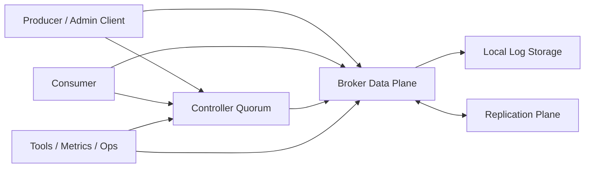
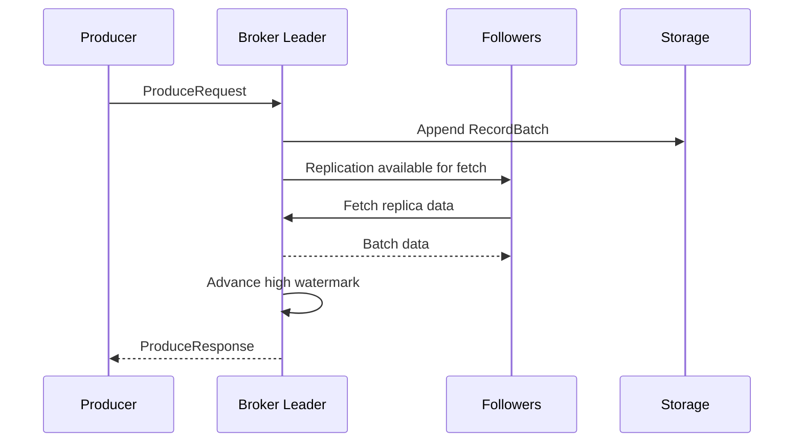

# Stellflow 概要设计文档

## 1. 文档目的

本文档用于定义 `stellflow` 的总体架构、核心子系统、模块边界与演进路线，为后续编码实现提供统一基线。

`stellflow` 的目标不是做一个“参考 Kafka 思想”的新消息队列，而是以现代 Kafka 主线架构为蓝本，使用纯 Java 与 JDK 25 重新实现其核心工程体系，在保证设计理念、运行模型、协议语义、存储语义和集群行为一致的前提下，去除 Scala 依赖，使整体代码结构更适合 Java 开发与长期维护。

## 2. 项目定位

### 2.1 产品定位

`stellflow` 是一个分布式日志与消息队列平台，面向以下场景：

- 异步解耦
- 事件分发
- 流式传输
- 高吞吐日志聚合
- 削峰填谷与任务缓冲
- 有状态或无状态流处理的基础数据总线

### 2.2 对标标准

本项目以 Kafka 现代主线架构为标准，遵循以下原则：

- 保持核心领域模型一致：Topic、Partition、Replica、Leader、ISR、Consumer Group、Offset、Epoch、Metadata Log。
- 保持关键工程思想一致：顺序追加日志、分区并行、批量网络传输、零拷贝优化方向、控制面与数据面分离、基于日志的元数据管理、复制状态机驱动的一致性。
- 保持核心运行角色一致：Broker、Controller Quorum、Producer、Consumer、Admin Client。
- 保持协议与行为语义兼容优先：实现时优先追求行为一致，而不是简单进行类名或源码的逐行翻译。

### 2.3 非目标

首阶段不以“额外创新功能”为目标，以下内容默认不作为一期优先项：

- 自定义消息模型替代 Topic/Partition 模型
- 引入与 Kafka 明显不同的元数据一致性机制
- 过早引入复杂 SQL、规则引擎或工作流能力
- 为了 Java 化而改变核心运行时行为

### 2.4 全局术语说明

为避免后续阅读复制、控制器、幂等和事务相关文档时混淆，`stellflow` 中以下三个“代次号”概念需要统一理解：

| 名称 | 所属层级 | 主要作用 | 核心回答的问题 |
| --- | --- | --- | --- |
| `Term` | Controller Quorum 共识层 | 标识控制器仲裁任期，约束控制面领导合法性与元数据提交正确性 | 当前哪个 Controller 领导任期是合法的 |
| `leaderEpoch` | Partition 复制层 | 标识分区 Leader 的代次，辅助副本同步、日志截断、元数据过期识别 | 当前这个分区的 Leader 是第几代 |
| `producerEpoch` | Producer 幂等/事务层 | 标识 Producer 实例代次，支持 fencing、幂等去重和事务接管 | 当前这个 Producer 实例是哪一代 |

补充说明：

- 三者都可以理解为“新旧代次判定号”
- 三者都在解决“谁是更新的一代”这个问题
- 但它们的作用范围不同，不能互相替代

进一步理解：

- `Term` 最接近 Raft 中的领导任期概念
- `leaderEpoch` 可以理解成分区级、局部语义下的 term-like generation
- `producerEpoch` 则是 Producer 自身的 generation，用于防止旧 Producer 在失效后继续写入

如果缺少这些代次号，会分别带来以下问题：

- 缺少 `Term`：控制面难以稳定判断哪个 Controller 领导任期有效
- 缺少 `leaderEpoch`：副本难以识别过期 Leader 视图，日志分叉后的截断恢复会更脆弱
- 缺少 `producerEpoch`：旧 Producer 难以被围栏，幂等和事务正确性会显著下降

在现代化、可治理、可追踪、多语言 MQ 设计中，请求头中的治理与追踪字段也需要统一理解：

| 字段 | 所属层级 | 主要作用 | 核心回答的问题 |
| --- | --- | --- | --- |
| `clientId` | 客户端识别与运维层 | 标识逻辑客户端来源，用于审计、基础限流、排障和客户端侧统计 | 这条请求来自哪个逻辑客户端 |
| `traceId` | 追踪与可观测性层 | 将跨进程、跨语言、跨组件请求串成同一条 trace | 这条请求链路属于哪一个全局追踪 |
| `tenantId` | 多租户治理层 | 标识资源归属、租户边界和租户级治理范围 | 这条流量属于哪个租户或业务域 |
| `quotaKey` | 配额与限流层 | 决定这条请求命中哪个配额桶或限流桶 | 这条流量应该按谁的配额规则治理 |
| `authContextId` | 认证与鉴权上下文层 | 透传请求级认证、代理、委托或上游身份映射上下文 | 这条请求带着哪个认证/委托上下文进入 Broker |
| `trafficClass` | 流量染色与调度层 | 对流量做灰度、优先级、旁路、后台任务等分类 | 这条流量属于什么治理等级或染色类别 |
| `trafficTag` | 染色实验与分组层 | 标识具体灰度批次、实验组、回放组或诊断流量分组 | 这条流量具体属于哪一组染色或实验 |

补充说明：

- 这几个字段都不负责协议路由
- 它们的主要职责是支撑治理、观测、限流、鉴权和流量分类
- 它们与 `clientId` 互补，而不是互相替代

进一步理解：

- `clientId` 解决“这是谁发来的逻辑客户端流量”
- `traceId` 解决“如何把请求链路串起来”
- `tenantId` 解决“资源归谁”
- `quotaKey` 解决“按谁限流/配额”
- `authContextId` 解决“请求带着哪个鉴权上下文”
- `trafficClass` 解决“这条流量按什么级别治理”
- `trafficTag` 解决“这条流量具体属于哪一组实验或染色批次”

如果缺少这些字段，会分别带来以下问题：

- 缺少 `clientId`：基础审计、基础限流和客户端来源排障都会变差
- 缺少 `traceId`：跨语言、跨 Broker、跨客户端的链路追踪会断裂
- 缺少 `tenantId`：多租户治理会退化到 topic、连接或 `clientId` 粗粒度维度
- 缺少 `quotaKey`：配额和限流难以从客户端身份中解耦
- 缺少 `authContextId`：代理转发、委托访问、上游认证透传场景会更难稳定落地
- 缺少 `trafficClass`：灰度流量、后台流量、控制流量和普通业务流量难以在请求入口处区分
- 缺少 `trafficTag`：同一客户端同时跑多组灰度、AB 实验、旁路流量或回放流量时，难以稳定区分具体实验组

### 2.5 请求头治理字段边界说明

下面这些字段看起来都和“请求是谁发来的”有关，但它们解决的是不同问题，因此不建议简单复用。

#### 2.5.1 为什么要把 `tenantId` 和 `clientId` 拆开

`clientId` 与 `tenantId` 的语义层级不同：

- `clientId` 表示“哪个逻辑客户端实例或应用在发请求”
- `tenantId` 表示“这条流量归属于哪个租户、业务域或资源边界”

不能简单复用的原因：

- 一个租户下可能有多个客户端
- 一个平台型客户端也可能服务多个租户
- `clientId` 更偏运维与排障维度
- `tenantId` 更偏治理与资源归属维度

如果混用：

- 多租户配额与 ACL 很容易和客户端实例命名绑死
- 客户端重命名、扩缩容、灰度发布都会影响租户治理规则
- 审计维度与资源归属维度会纠缠在一起

一句话：

- `clientId` 回答“谁在发”
- `tenantId` 回答“这条流量属于谁”

#### 2.5.2 为什么要有 `quotaKey`

限流不只是“限流结果”，更重要的是“按谁限流”。

`quotaKey` 的作用是明确：

- 这条请求应该进入哪个配额桶
- 这个桶是否按租户、按客户端、按用户、按业务线或按内部任务维度划分

为什么不能只靠 `clientId` 或 `tenantId`：

- 有时配额要按租户限，而不是按客户端限
- 有时多个客户端需要共享同一个配额桶
- 有时一个客户端内部又要拆成多个限流群组

如果没有 `quotaKey`：

- 配额逻辑只能硬编码绑定到 `clientId`、`tenantId` 或连接身份
- 后期做共享额度、租户总额度、后台任务独立额度时会很别扭

一句话：

- `quotaKey` 不是限流结果
- 它是“限流归属键”

#### 2.5.3 为什么要有 `authContextId`

`clientId` 不是认证身份，它只是逻辑来源名。

`authContextId` 的作用是：

- 透传上游认证或代理认证上下文
- 标识委托访问、代理访问、代表访问等复杂请求语义
- 帮助 Broker 把“连接身份”和“请求身份映射上下文”区分开

为什么不能直接拿 `clientId` 当认证：

- `clientId` 可以随客户端自定义，不能作为安全边界
- 同一个 `clientId` 不等于同一个认证主体
- 代理或网关代发请求时，连接主体和最终请求主体可能不同

如果混用：

- 会把审计名和认证主体混在一起
- 代理转发、委托访问、多跳鉴权会难以落地
- 安全模型会变脆弱

一句话：

- `clientId` 是“我是哪个客户端”
- `authContextId` 是“我带着哪套认证/委托上下文来”

#### 2.5.4 为什么要有 `trafficClass`

`trafficClass` 的核心价值不是“能不能染色”，而是“能不能稳定治理”。

为什么不建议直接用任意 `string`：

- 自由文本容易失控，取值会越来越散
- 高基数字符串会让指标、限流和规则判断变复杂
- 不同语言客户端容易拼出不同写法，例如 `canary`、`gray`、`grey`

`trafficClass` 更适合表达稳定枚举，例如：

- `0`：基准业务流量
- `1`：灰度流量
- `2`：后台任务流量
- `3`：控制流量

这样做的好处：

- 规则判断更稳定
- 指标维度更可控
- 多语言 SDK 更容易统一

如果确实需要更细粒度描述：

- 可以在请求头里额外携带具体分组标识，例如 `trafficTag`
- 但主治理字段 `trafficClass` 仍更适合稳定枚举，而不是开放文本

#### 2.5.5 为什么还要有 `trafficTag`

`trafficClass` 只回答“这一类流量该怎么治理”，但它不回答“这一条流量具体属于哪一组实验或染色批次”。

为什么不能只用 `trafficClass = 1` 表示染色流量：

- 同一个客户端可能同时运行多组灰度、AB 实验或回放流量
- 多组实验可能都属于“灰度流量”，但它们需要不同的观测、诊断和路由分析
- `trafficClass` 适合低基数治理，不适合承载具体实验标识

`trafficTag` 更适合表达具体分组，例如：

- `exp-order-v2-a`
- `canary-shanghai-01`
- `replay-risk-check`

这样拆分的好处：

- `trafficClass` 继续保持低基数、适合配额与调度
- `trafficTag` 单独承担具体实验组标识
- 既能稳定治理，也能支持同一客户端并行跑多组染色流量

需要注意：

- `trafficTag` 可以是字符串
- 但它不应作为默认的全局高基数指标标签暴露
- 更适合作为日志、trace attribute 和按需采样的诊断维度

#### 2.5.6 为什么要有 `spanId`

`spanId` 和 `clientId` 也不是一个意思。

- `clientId` 表示逻辑客户端来源
- `spanId` 表示当前 trace 中这个请求跨度的标识

为什么不能用 `clientId` 代替 `spanId`：

- 一个客户端会发无数个请求，不可能每个请求都共用同一个 span
- 链路追踪需要区分“这一次调用”和“这个应用是谁”
- `spanId` 是请求级别的，`clientId` 是应用级别的

如果没有 `spanId`：

- 你仍然可以有粗粒度 `traceId`
- 但 Broker、Producer、Consumer、Replica 之间的细粒度调用边界会更难表达
- 尤其在一个 trace 内存在多个并发请求或子调用时，诊断能力会下降

一句话：

- `clientId` 表示“哪个客户端应用”
- `spanId` 表示“这一次具体请求跨度”

## 3. 设计目标

### 3.1 功能目标

- 提供完整的 Topic/Partition 日志存储模型
- 支持 Producer 发送、Consumer 拉取、Offset 提交
- 支持 Consumer Group 协调与再均衡
- 支持多副本复制、Leader/Follower 同步与故障转移
- 支持 Controller 管理集群元数据与分区领导者分配
- 支持 ACL、配额、配置管理、管理命令等平台能力的演进扩展

### 3.2 质量目标

- 高吞吐：基于顺序写、批处理、页缓存友好设计
- 低延迟：减少锁竞争与无效复制
- 可扩展：按 Topic/Partition 水平扩展
- 高可用：多副本与控制器仲裁机制保障服务连续性
- 可观测：暴露关键指标、状态与审计日志
- 可维护：按 Java 模块清晰拆分，消除 Scala 特性迁移带来的理解门槛

### 3.3 技术目标

- 基于 JDK 25 实现
- 优先使用 Java 原生并发模型、记录类型、密封接口、增强集合能力等现代语言特性
- 避免为了“写法模仿”而保留 Scala 风格的复杂继承层次
- 保持对象模型清晰，并将热点路径上的对象分配与复制成本控制在可接受范围内

## 4. 总体架构

### 4.1 架构视图

`stellflow` 整体由控制面、数据面、客户端与工具链四个层次构成：



### 4.2 核心角色

#### 4.2.1 Broker

Broker 是数据面的核心节点，负责：

- 处理 Produce、Fetch、ListOffsets、OffsetCommit 等请求
- 管理本地分区日志、索引、清理与保留策略
- 承担分区 Leader 或 Follower 角色
- 执行副本同步与高水位推进
- 协助完成 Group 协调、事务、配额、认证授权等功能

#### 4.2.2 Controller Quorum

Controller Quorum 是控制面核心，负责：

- 管理集群元数据日志
- 维护 Broker 注册信息
- 管理 Topic、Partition、Replica 分配结果
- 处理分区 Leader 选举与故障转移
- 驱动配置变更与集群拓扑变更

设计上以基于日志复制的仲裁集群为核心，不再引入外部协调系统。

#### 4.2.3 Producer

Producer 负责：

- 元数据拉取与缓存
- 记录批量聚合
- 按分区路由发送
- 重试、超时、幂等与压缩
- 与 Broker 协商 ACK 级别及可靠性语义

#### 4.2.4 Consumer

Consumer 负责：

- 按 Topic/Partition 拉取消息
- 维护消费位点
- 加入 Consumer Group
- 参与分区分配与再均衡
- 控制拉取窗口、背压与提交策略

## 5. 核心设计原则

### 5.1 行为等价优先

Java 重写的目标是行为等价，而不是语法等价。对于 Scala 代码中的伴生对象、模式匹配、不可变集合链式变换等实现方式，需要映射为更适合 Java 的设计，但不得破坏以下内容：

- 状态机迁移规则
- 异常处理语义
- 请求处理顺序
- 并发可见性要求
- 持久化格式与恢复逻辑

### 5.2 控制面与数据面分离

元数据管理、领导者选举、Broker 注册属于控制面；消息追加、拉取、复制、刷盘属于数据面。两者分离有助于：

- 降低耦合
- 提升故障隔离能力
- 明确性能优化边界
- 支持后续管理工具独立演进

### 5.3 日志即事实来源

无论是消息数据还是集群元数据，都以追加日志作为事实来源。内存结构仅作为缓存、索引或派生视图，节点恢复时必须能够通过日志重建关键状态。

### 5.4 批处理优先

网络收发、消息编码、磁盘写入、复制同步与消费拉取均以批处理为默认优化方向，避免单消息路径成为性能瓶颈。

## 6. 逻辑架构设计

### 6.1 分层结构

建议采用如下逻辑分层：

- `api`：对外协议对象、错误码、公共数据结构
- `common`：工具类、时间、线程、缓冲区、压缩、序列化基础设施
- `network`：请求解码、连接管理、I/O 多路复用、响应写回
- `metadata`：元数据模型、缓存、日志回放、控制器视图
- `controller`：控制器状态机、选举、Broker 注册、分区分配
- `server`：Broker 启动、生命周期、请求入口、服务装配
- `storage`：日志段、索引、时间索引、事务索引、刷盘与恢复
- `replica`：副本状态、高水位、ISR 管理、同步机制
- `coordinator`：Group 协调、Offset 管理、事务协调
- `clients`：Producer、Consumer、Admin 客户端
- `security`：认证、授权、ACL、配额
- `tools`：命令行工具、诊断工具、运维脚本

### 6.2 推荐包结构

建议以单仓多模块或单模块分包两种模式启动。考虑当前仓库尚早期，建议先采用单模块分包，待协议、存储、客户端稳定后再拆 Maven 子模块。推荐包前缀如下：

```text
io.github.stellhub.stellflow.api
io.github.stellhub.stellflow.common
io.github.stellhub.stellflow.network
io.github.stellhub.stellflow.metadata
io.github.stellhub.stellflow.controller
io.github.stellhub.stellflow.server
io.github.stellhub.stellflow.storage
io.github.stellhub.stellflow.replica
io.github.stellhub.stellflow.coordinator
io.github.stellhub.stellflow.clients
io.github.stellhub.stellflow.security
io.github.stellhub.stellflow.tools
```

### 6.3 典型进程内组件关系

Broker 进程内建议包含以下核心组件：

- `BrokerServer`：进程生命周期总控
- `SocketServer`：网络接入与请求分发
- `RequestChannel`：请求在网络层与处理层之间的中转
- `RequestHandlerPool`：请求处理线程池
- `ReplicaManager`：分区、副本、追加、拉取、高水位管理
- `LogManager`：日志目录、日志段加载、恢复与定时任务
- `MetadataCache`：集群元数据缓存
- `GroupCoordinator`：消费组协调与位点管理
- `QuotaManager`：限流与配额
- `Authorizer`：权限校验

Controller 进程内建议包含以下核心组件：

- `ControllerServer`：控制器节点生命周期
- `MetadataLog`：元数据日志读写与回放
- `QuorumManager`：仲裁与复制状态管理
- `ClusterControlManager`：Broker 注册、心跳、围栏控制
- `ReplicationControlManager`：分区、副本、Leader 选举控制
- `ConfigurationControlManager`：动态配置管理

## 7. 关键子系统设计

### 7.1 网络层

网络层负责将连接、请求帧、协议对象和业务处理解耦，核心职责包括：

- 监听客户端与 Broker/Controller 间连接
- 对请求头与请求体做版本化解析
- 将请求投递到处理线程池
- 将结果编码后异步回写
- 处理连接空闲、认证、限流与异常关闭

设计重点：

- 使用清晰的 `Request` / `Response` 模型替代动态类型分发
- 解耦协议版本处理与业务逻辑
- 为高吞吐场景预留零拷贝和批量发送优化点

### 7.2 存储层

存储层延续 Kafka 的追加日志模型，每个 TopicPartition 对应一条逻辑日志，由多个日志段组成。每个日志段通常包含：

- 数据文件
- 偏移量索引文件
- 时间索引文件
- 事务相关索引文件
- 校验与快照辅助文件

核心职责：

- 顺序追加记录批
- 按偏移量读取记录
- 维护段滚动、删除与压缩清理
- 启动恢复与异常截断
- 维护高水位、日志起始位点与恢复位点

设计重点：

- 存储格式必须稳定，避免早期频繁变更
- 明确内存映射、页缓存与刷盘策略
- 将“日志逻辑”和“文件系统细节”隔离在不同抽象层中

### 7.3 复制子系统

复制子系统围绕 Leader/Follower 模型运行，核心职责包括：

- Leader 接收写入并分发给 Follower 拉取
- Follower 基于位点向 Leader 同步数据
- 维护 ISR 集合
- 推进高水位并决定可见性
- 节点异常时参与领导者切换

设计重点：

- 复制状态必须由明确状态机驱动
- Epoch 与日志截断规则必须严格一致
- 高水位推进逻辑必须避免可见性倒退

### 7.4 元数据与控制器

元数据子系统负责管理整个集群的拓扑和配置，是控制面的大脑。核心元数据包括：

- Broker 注册信息
- Topic、Partition 与 Replica 分配
- Partition Leader 与 ISR
- 配置项与配额项
- Feature Level 与集群能力协商结果

设计重点：

- 元数据必须可回放、可快照、可重建
- 控制器变更操作必须序列化
- 元数据缓存与持久化日志之间要有明确一致性边界

### 7.5 Group 协调

Group 协调负责 Consumer Group 的成员管理、分区分配和位点提交。核心职责包括：

- 管理组成员 Join/Sync/Heartbeat/Leave 生命周期
- 维护组状态与代次
- 执行再均衡
- 维护消费位点与提交语义

设计重点：

- 组状态机必须独立建模
- 心跳超时与会话超时要有精确时序控制
- 分区分配策略要支持后续扩展

### 7.6 客户端子系统

客户端子系统分为 Producer、Consumer、Admin 三类：

- Producer：关注分区路由、批量发送、压缩、幂等、重试与顺序保障
- Consumer：关注拉取、位点管理、组协调、反压与再均衡恢复
- Admin：关注 Topic 管理、配置修改、诊断与运维操作

设计重点：

- 客户端与服务端共享协议模型，但不共享服务端运行时依赖
- API 设计优先保证可预测性与可测试性

## 8. 数据模型设计

### 8.1 核心领域对象

核心领域对象建议包括：

- `TopicName`
- `TopicId`
- `TopicPartition`
- `BrokerId`
- `ReplicaId`
- `LeaderAndEpoch`
- `OffsetAndEpoch`
- `RecordBatch`
- `MemoryRecords`
- `FetchPartitionData`
- `PartitionRegistration`
- `BrokerRegistration`
- `ConsumerGroupId`

### 8.2 状态对象与命令对象分离

建议区分以下两类对象：

- 状态对象：代表当前系统事实，例如 `PartitionState`、`BrokerRegistration`
- 命令对象：代表一次控制或请求动作，例如 `CreateTopicCommand`、`AlterIsrCommand`

这样可以降低并发更新带来的混乱，并有利于事件回放与测试。

### 8.3 不可变对象优先

在元数据、协议对象、日志视图等场景下，优先使用不可变对象，以减少共享状态错误。对热点路径可使用可控可复用缓冲区，但必须限制其作用域。

## 9. 关键流程设计

### 9.1 Produce 流程



处理要点：

- 分区路由必须基于最新元数据
- 写入响应时机受 ACK 级别控制
- 幂等写入要绑定 Producer 身份与序列号

### 9.2 Fetch 流程

Consumer 或 Follower 发起 Fetch 请求，Broker 根据偏移量、隔离级别和最大字节数返回数据批。处理要点：

- 按高水位控制读可见性
- 支持长轮询减少空转
- 对普通消费者与副本同步请求做不同处理路径优化

### 9.3 Controller 变更流程

控制器接收元数据变更命令后，按顺序写入元数据日志，再由状态机回放并更新内存视图，最终将增量元数据传播给相关 Broker。处理要点：

- 控制命令必须串行落日志
- Broker 应以版本化增量方式更新缓存
- 故障恢复后必须通过日志与快照重建视图

## 10. 一致性与可靠性设计

### 10.1 一致性边界

`stellflow` 的一致性设计遵循如下边界：

- 元数据一致性由控制器仲裁日志保障
- 分区数据一致性由副本复制与高水位机制保障
- 消费位点一致性由协调器与位点持久化机制保障

### 10.2 故障处理原则

- Broker 宕机后，Controller 负责重新分配分区领导者
- Follower 落后过多时应退出 ISR
- 恢复节点必须通过日志校正与截断重新追平
- 元数据节点切换必须保证单控制器生效语义

### 10.3 恢复原则

- 启动时先恢复日志与索引
- 再恢复元数据缓存与副本状态
- 最后开放网络流量

## 11. 并发模型设计

### 11.1 线程模型

建议采用职责分离线程模型：

- Acceptor 线程：接收连接
- Network Processor 线程：读写网络数据
- Request Handler 线程：处理协议请求
- Background Scheduler 线程：日志清理、刷盘、配额刷新、超时扫描
- Replica Fetcher 线程：Follower 同步
- Controller Event 线程：串行处理控制面事件

### 11.2 并发原则

- 状态机更新尽量串行化
- 热点共享状态使用细粒度同步或无锁数据结构
- I/O 线程不承载重业务逻辑
- 避免在高频路径引入大对象分配与不必要装箱

## 12. 可观测性设计

### 12.1 指标

首批建议暴露以下指标：

- 请求吞吐、平均延迟、P99 延迟
- Produce / Fetch 请求速率与错误数
- TopicPartition 写入速率、读取速率、积压深度
- ISR 变化次数
- Controller 选举次数
- 日志刷盘延迟
- 消费组再均衡次数

### 12.2 日志

日志体系建议区分：

- 启动日志
- 请求异常日志
- 复制状态日志
- 控制器变更日志
- 审计日志

### 12.3 健康检查

建议提供：

- Broker 存活状态
- Controller 连接状态
- 日志目录可写状态
- 副本同步健康状态

## 13. 安全与治理设计

后续能力应预留以下设计接口：

- SASL / TLS 认证
- ACL 权限控制
- 客户端配额
- Topic 级与用户级限流
- 动态配置变更

设计原则是先定义扩展点与抽象接口，再逐步实现具体机制，避免后续改动核心请求链路。

## 14. 模块演进建议

### 14.1 一期目标

一期建议实现最小可运行闭环：

- 单 Broker 启动
- 基础 Topic/Partition 日志写入与读取
- 简化元数据管理
- Producer/Consumer 基本通信
- Offset 提交与恢复

目标是先跑通完整消息链路，验证协议、存储和线程模型。

### 14.2 二期目标

- 多 Broker 集群
- Controller Quorum
- 多副本同步
- Leader 选举与故障切换
- 基础 Group 协调

### 14.3 三期目标

- 幂等生产
- 事务消息
- ACL 与配额
- 日志压缩
- 更完整的运维与诊断工具

## 15. 当前仓库落地建议

结合当前仓库仍处于初始化阶段，建议按以下顺序推进：

1. 建立基础目录结构与包结构。
2. 完成公共领域模型与错误码体系。
3. 完成网络协议抽象与请求分发主链路。
4. 完成存储层最小闭环，包括日志段追加、读取与恢复。
5. 在单机模式下打通 Producer -> Broker -> Consumer 全链路。
6. 再引入 Controller、复制与 Group 协调。

## 16. 风险与关键决策

### 16.1 主要风险

- 过早按类名翻译源码，导致 Java 设计僵化且难维护
- 协议语义尚未稳定前就拆分过多 Maven 模块
- 存储格式频繁变动，造成恢复与兼容成本陡增
- 控制器与 Broker 边界不清，导致后续复制与选举逻辑耦合

### 16.2 关键决策

- 采用“行为对齐 Kafka、实现风格偏 Java 原生”的总体策略
- 采用“先单机闭环、再集群复制、后高级语义”的分阶段路线
- 采用“先单模块分包、后稳定拆模块”的工程组织方式

## 17. 结论

`stellflow` 的核心建设方向应当是：以现代 Kafka 主线架构为标准，以 Java 和 JDK 25 为实现载体，在不改变核心语义的前提下，重新建立一个分层清晰、运行模型稳定、便于长期演进的消息队列内核。

当前最重要的不是立即铺开全部功能，而是先用统一的领域模型、请求链路、日志存储和控制面边界搭出稳定骨架。本文档即作为这一骨架的第一版概要设计基线，后续详细设计文档应围绕存储层、复制层、控制器层、协调器层分别展开。
