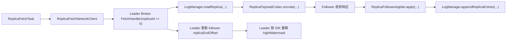

# Stellflow Replica Fetch 运行设计

## 1. 目标

当前 `stellflow` 已经有：

- `FetchHandler` 的 `Replica Fetch` 分支
- `ReplicaFollowerApplier`
- `storage.log` 的 follower 侧本地日志追加

这次补齐的是：

- broker 进程内真正的 follower 后台拉取循环
- `Replica Fetch` 从短连接轮询升级为按 leader 维度长连接复用
- 同一 leader 的多分区可在单连接上并发复用，并通过 `correlationId` 做 in-flight pipeline 关联
- 单次调度内按 `pipelineRoundsPerPoll` 连续推进多轮抓取
- `highWatermark` 通过真实网络复制推进
- `OpenTelemetry` 风格指标接入
- Prometheus 可直接抓取的 HTTP `/metrics` 端口
- `leaderEpoch` 的更细粒度截断恢复
- 通过 gRPC 控制面动态下发 replica assignments
- 通过 gRPC 控制面动态下发 partition control 命令并回报 broker 应用结果

## 2. 后台拉取循环

### 2.1 组件

当前运行时组件如下：

- `ReplicaFetchManager`
- `ReplicaFetchTask`
- `ReplicaFetchNetworkClient`
- `ReplicaFollowerApplier`
- `ControllerBrokerControlClient`
- `ControllerBrokerControlServer`

职责分工：

- `ReplicaFetchManager`
  负责管理 assignment 和定时调度
- `ReplicaFetchTask`
  负责单分区循环抓取和 pipeline 推进
- `ReplicaFetchNetworkClient`
 负责按 leader 维度复用长连接，并在同一连接上承载多个分区的 in-flight 抓取请求
- `ReplicaFollowerApplier`
  负责把 leader 返回的复制载荷追加到 follower 本地日志
- `ControllerBrokerControlClient`
 负责向 controller 注册 broker，watch 动态 assignments / partition control 命令，并回报命令应用结果
- `ControllerBrokerControlServer`
  负责 controller 侧 gRPC 控制面服务

### 2.2 当前 assignment 配置格式

当前系统同时支持两种 assignment 来源：

1. 静态 fallback 配置
2. gRPC 控制面动态下发

静态配置格式仍然保留为：

```yaml
stellflow:
  replica:
    fetch:
      assignments: "orders:0@stellflow://10.0.0.12:9092#0,payments:1@stellflow://10.0.0.13:9092#2"
```

格式为：

- `topic:partition@stellflow://leaderHost:leaderPort#leaderBrokerId`

当 `stellflow.controlPlane.grpc.clientEnabled=true` 时：

- broker 会优先使用 gRPC watch stream 收到的动态 assignments
- 新下发的 assignment 会替换本地 manager 中的旧 assignment

因此当前静态配置主要作为：

- 本地调试 fallback
- 无 controller 环境下的联调入口

这里的 `stellflow://` 只用于配置和元数据表达，不会出现在真实网络报文里。

## 3. 复制流程



核心点：

- follower 通过真实网络请求拉数据
- 同一 leader 的多个分区会复用同一条 TCP 连接
- 连接内请求通过 `correlationId` 做关联，可支持真正的 in-flight pipeline
- 一次调度内可连续推进多轮抓取，以更快追平 lag
- leader 端不是简单回业务字节，而是回结构化 replica payload
- follower 本地按 `offset / timestamp / leaderEpoch / records` 正式落盘
- leader 在响应后更新该 follower 的复制进度
- `highWatermark` 由 ISR 最小复制进度推进

## 4. 为什么需要 OTel + Prometheus `/metrics`

后台复制链路最常见的问题不是“会不会跑”，而是：

- 为什么 lag 突然变大
- 哪个 follower 一直落后
- 是否持续失败重试
- 复制吞吐是否不足

所以复制任务必须至少暴露这几类指标：

- 请求次数
- 失败次数
- 抓取字节数
- 抓取条目数
- 当前 lag
- 最近一次成功/失败时间

当前代码里已经通过 `ReplicaFetchMetrics` 暴露这些指标。

## 5. 为什么指标端口选 JDK `HttpServer`

### 5.1 当前最合适的选择

当前实现选择：

- `com.sun.net.httpserver.HttpServer`

而不是：

- 复用 Netty 再起一套 HTTP pipeline
- 直接引入 Servlet 容器
- 直接依赖 OTel Java 的 Prometheus exporter alpha 组件

### 5.2 原因

对 `stellflow` 当前阶段来说，JDK `HttpServer` 最合适，原因有 4 个：

1. 依赖最少
- JDK 自带
- 不需要再引一层 servlet 或 web framework

2. 与数据面隔离
- 数据面继续专注 Netty 二进制协议
- metrics 端口是低 QPS、低吞吐、只读 scrape 场景

3. 故障边界清晰
- 即使数据面连接很多，metrics 端口也不会复用同一套业务 pipeline
- 排障时更容易判断问题在数据面还是在观测面

4. 当前 OTel Java Prometheus exporter 生态仍更适合谨慎接入
- `stellflow` 当前已经明确是 OTel-first
- 但本项目此阶段更适合“OTel API 打点 + 本地 Prometheus pull 端口稳定暴露”
- OpenTelemetry Java SDK 文档目前仍把 `PrometheusHttpServer` 列为 `io.opentelemetry:opentelemetry-exporter-prometheus:1.62.0-alpha`
- 等控制面、复制面和 SDK 体系更稳定后，再评估统一 exporter

### 5.3 当前设计结论

当前推荐组合是：

- 指标模型：OpenTelemetry 命名与属性
- 本地抓取端口：JDK `HttpServer`
- Prometheus：主动 scrape `/metrics`

这对当前工程阶段是最稳的。

## 6. retention 为什么必须存在

### 6.1 不删除行不行

理论上可以不删，但实际工程上通常不行。

如果完全不做 retention，会有几个问题：

1. 磁盘会无限增长
2. segment 数量会持续膨胀
3. 恢复时间会越来越长
4. 索引和 checkpoint 管理成本会持续增大
5. follower 重新同步和时间查询都会越来越重

所以 retention 不是“可选优化”，而是：

- **日志系统的基本生命周期治理能力**

### 6.2 三种策略为什么要同时保留

`retentionSegments`

- 控制段数量上限
- 适合测试环境和小规模部署
- 对 segment rolling 结果最直观

`retentionMs`

- 控制保留时间窗口
- 适合“保留最近 N 天数据”的业务诉求
- 是最常见的运维视角

`retentionBytes`

- 控制磁盘预算
- 适合资源受限部署
- 防止单分区无限吃掉磁盘

三者不是重复，而是三种不同治理目标：

- 数量
- 时间
- 空间

当前实现里，这三类策略会共同决定哪些已滚动 segment 可以被清理。

### 6.3 这是不是 Kafka 默认保存时间

Kafka 长期以来常见默认值是：

- `log.retention.hours = 168`

也就是：

- 7 天

`stellflow` 当前默认 `retentionMs = 604800000`，也是 7 天，目的是保持大家对日志型 MQ 的默认预期一致。

但要注意：

- 这是当前默认值，不是协议强约束
- 具体保留窗口最终还是部署配置问题

## 7. `leaderEpoch` 更细粒度截断恢复

### 7.1 为什么不能只用 `truncateToOffset`

`truncateToOffset` 能做强制截断，但它要求控制面已经算出一个明确 offset。

在真实复制场景里，很多时候更自然的问题是：

- follower 本地比 leader 多出几个“属于旧 epoch”的尾部批次
- 我知道要回退到哪个 `leaderEpoch`
- 但我不一定在控制命令入口就已经算好了精确 offset

所以需要：

- 按 epoch 分叉点做截断

### 7.2 当前实现

当前补了：

- `leader-epoch.checkpoint`
- `LeaderEpochCheckpoint`
- `LogManager.truncateToLeaderEpoch(...)`
- `UnifiedLog.truncateToLeaderEpoch(...)`

语义是：

- 找到“目标 epoch 之后的下一个 epoch 的起始 offset”
- 将日志截断到这个 offset

这样就能把“所有更晚 epoch 的尾部日志”整体裁掉。

### 7.3 例子

假设日志分布如下：

- epoch 0: offset `0,1`
- epoch 1: offset `2`
- epoch 2: offset `3,4`

如果要回退到 `leaderEpoch = 1`：

- 就应当把 epoch 2 的数据整体裁掉
- 截断点就是 epoch 2 的起始 offset `3`

最终保留：

- `0,1,2`

### 7.4 当前控制面联动

`PartitionControlCommand` 现在已经支持：

- `truncateToLeaderEpoch`
- `truncateToOffset`

这意味着：

- 控制面可以只给出 epoch 边界
- 也可以继续给出明确 offset
- 两种方式可以并存

## 8. 当前限制

当前这一版已经能跑通真实 follower 后台抓取，但还不是最终版，仍有这些限制：

1. 当前共享连接已经支持多分区复用，但还没有做更复杂的流控与背压策略
2. gRPC 控制面已经能动态下发 assignment 和 partition control，但还没有接入更完整的 controller 元数据状态机
3. 指标端口目前是本地暴露，不是统一 exporter 管理
4. `leaderEpoch` 截断已经支持按边界处理，但还没有做更复杂的 epoch 分叉比较协议

## 9. 下一步建议

后续最自然的演进顺序是：

1. gRPC 控制面动态下发 replica assignment
2. partition control 命令与 controller 元数据状态机进一步整合
3. 更完整的 leader epoch 分叉协商
4. 指标字典补充 replica fetch 运行指标和告警建议
