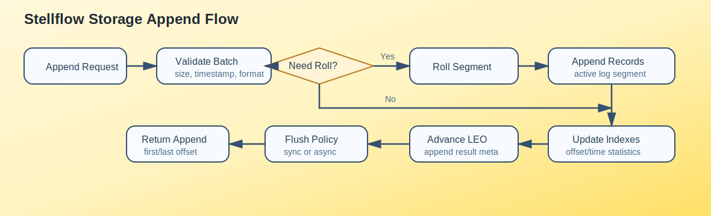
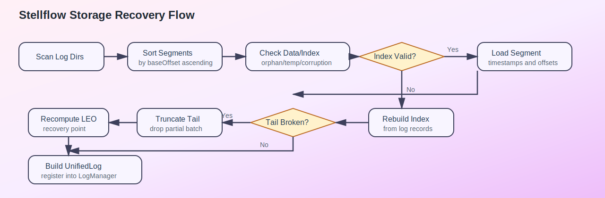
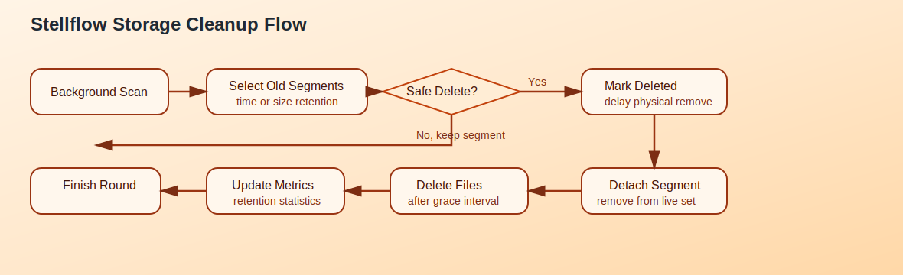

# Stellflow 存储层详细设计

## 1. 文档目标

本文档在概要设计基础上，进一步定义 `stellflow` 存储层的职责边界、核心对象、文件组织、关键流程、并发模型与恢复策略，作为后续 `storage`、`replica`、`server` 模块编码实现的直接依据。

本设计以现代 Kafka 日志子系统为标准，保持顺序追加、段文件管理、索引加速、恢复可重建和高水位可见性控制等核心思想一致，同时结合 JDK 25 的实现能力，采用更清晰的 Java 分层方式落地。

## 2. 设计目标

### 2.1 功能目标

- 支持按 `TopicPartition` 维护独立日志
- 支持记录批顺序追加、按偏移量读取
- 支持日志段滚动、恢复、删除和压缩预留
- 支持 Leader/Follower 共享一套底层存储抽象
- 支持高水位、日志起始位点、恢复位点等关键位点管理

### 2.2 非功能目标

- 写路径以顺序 I/O 为主
- 读路径优先利用索引减少扫描
- 崩溃恢复流程必须可重复执行
- 文件格式必须稳定，避免早期频繁变动
- 目录布局必须支持多日志目录扩展

## 3. 职责边界

存储层只负责“本地日志事实”的维护，不负责元数据选举、分区领导者决策和网络协议收发。

### 3.1 存储层负责

- 日志目录与分区目录管理
- 段文件生命周期管理
- 记录批编码后的持久化追加
- 偏移量索引、时间索引、事务索引维护
- 日志恢复、校验、异常截断
- 日志保留、删除与压缩扩展点预留

### 3.2 存储层不负责

- 请求鉴权与网络编解码
- Topic 元数据分配
- ISR 选举决策
- Consumer Group 协调
- 复制状态机本身的控制逻辑

## 4. 逻辑架构

### 4.1 核心抽象

建议定义以下核心抽象：

- `LogManager`：管理所有日志目录和 `UnifiedLog`
- `UnifiedLog`：单个 `TopicPartition` 的逻辑日志入口
- `LogSegments`：维护有序段集合
- `LogSegment`：单个物理日志段
- `OffsetIndex`：相对位移到物理位置索引
- `TimeIndex`：时间戳到偏移量索引
- `TransactionIndex`：事务相关索引预留
- `LogCleaner`：压缩清理后台组件
- `LogRetentionManager`：保留策略扫描与删除控制
- `LogRecoveryService`：启动恢复与异常修复

### 4.2 组件关系

```text
LogManager
  -> UnifiedLog(topic-partition)
      -> LogSegments
          -> LogSegment(baseOffset)
              -> LogDataFile
              -> OffsetIndex
              -> TimeIndex
              -> TransactionIndex
```

### 4.3 Broker 内部协作关系

- `ReplicaManager` 调用 `UnifiedLog.appendAsLeader` 或 `appendAsFollower`
- `ReplicaManager` 调用 `UnifiedLog.read`
- `Partition` 持有高水位、LEO、Leader Epoch 相关状态
- `LogManager` 提供日志加载、获取、关闭和定时任务入口

## 5. 目录与文件设计

### 5.1 目录结构

建议采用如下目录布局：

```text
data/
  meta/
  logs/
    topicA-0/
      00000000000000000000.log
      00000000000000000000.index
      00000000000000000000.timeindex
      00000000000000000000.txnindex
      00000000000000000000.snapshot
      00000000000000102400.log
      ...
    topicA-1/
    __cluster_metadata-0/
```

### 5.2 文件命名规则

- 文件名前缀使用 20 位零填充 `baseOffset`
- 数据文件后缀使用 `.log`
- 偏移量索引后缀使用 `.index`
- 时间索引后缀使用 `.timeindex`
- 事务索引后缀使用 `.txnindex`
- 快照或恢复辅助文件使用 `.snapshot` 或 `.checkpoint`

### 5.3 原子性要求

- 新段创建时必须先完成目录与文件占位，再暴露给段集合
- 索引重建时应写临时文件后原子替换
- 删除段时优先标记为待删除，再异步物理清理

## 6. 核心数据结构设计

### 6.1 UnifiedLog

`UnifiedLog` 是日志访问的统一入口，建议包含：

- `TopicPartition topicPartition`
- `LogConfig config`
- `LogSegments segments`
- `long logStartOffset`
- `long recoveryPoint`
- `LeaderEpochFileCache leaderEpochCache`
- `ProducerStateManager producerStateManager`
- `ReentrantReadWriteLock lock`

职责：

- 追加写
- 读取
- 滚段
- 刷盘
- 截断
- 恢复
- 索引维护

### 6.2 LogSegment

单段建议维护如下状态：

- `long baseOffset`
- `FileRecords records`
- `OffsetIndex offsetIndex`
- `TimeIndex timeIndex`
- `TransactionIndex transactionIndex`
- `Timestamp largestTimestamp`
- `long maxTimestampSoFar`
- `int size`

职责：

- 追加记录批到段尾
- 按偏移量查找物理位置
- 维护索引稀疏写入
- 执行段级恢复、截断、关闭

### 6.3 索引结构

偏移量索引建议采用稀疏索引模型：

- 索引键为相对偏移量
- 索引值为物理文件位置
- 每达到一定字节间隔再写索引项

时间索引建议采用：

- 键为最大时间戳
- 值为对应消息偏移量

这样可以在兼顾空间占用的同时，维持较高的读取效率。

## 7. 写路径详细设计

### 7.1 写入入口

写入入口区分为两类：

- `appendAsLeader`：Leader 接收客户端写入
- `appendAsFollower`：Follower 接收复制同步数据

两者共用底层段追加逻辑，但在校验、ACK、幂等、位点推进和错误处理上存在差异。

### 7.2 Leader 写入流程



Leader 追加的处理步骤如下：

1. 校验分区是否允许写入。
2. 校验消息批格式、压缩格式、时间戳与大小限制。
3. 分配逻辑偏移量并构建待写批次。
4. 判断当前活动段是否需要滚动。
5. 追加到活动段数据文件。
6. 根据索引间隔更新偏移量索引和时间索引。
7. 更新 LEO、最大时间戳与统计指标。
8. 根据刷盘策略决定是否立即刷盘或异步刷盘。
9. 将结果返回给复制子系统，等待 ACK 条件满足。

### 7.3 段滚动策略

满足以下任一条件时触发滚段：

- 当前段大小达到 `segment.bytes`
- 当前段写入时间超过 `segment.ms`
- 当前批次写入后会导致索引上限溢出
- 恢复或截断后要求重新切段

滚段要求：

- 新段 `baseOffset` 必须等于旧段的下一个可写偏移量
- 切段过程对读路径可见性必须一致
- 切段后旧段转为只读段，活动段切换为新段

### 7.4 写路径设计约束

- 活动段写入必须串行，避免同一分区多线程交错写
- 分区级别允许并发，但单分区内保持顺序
- 追加结果必须包含首尾偏移量、最大时间戳、是否滚段等元信息

## 8. 读路径详细设计

### 8.1 读取入口

统一由 `UnifiedLog.read` 提供读取服务，输入参数建议包括：

- 起始偏移量
- 最大字节数
- 最大批次数
- 隔离级别
- 是否允许返回控制批
- 拉取来源类型

### 8.2 读取流程

1. 校验请求偏移量是否小于 `logStartOffset`
2. 根据隔离级别确定最大可见偏移量
3. 在段集合中定位包含目标偏移量的段
4. 使用偏移量索引定位物理位置
5. 顺序读取一个或多个批次直到满足上限
6. 返回数据批与高水位、最后稳定偏移量等附加元信息

### 8.3 可见性控制

对普通消费者：

- 默认只能读到高水位以内的数据
- 事务隔离级别为 `read_committed` 时只能读到最后稳定偏移量以内的数据

对 Follower 副本：

- 可以读取高水位之后但已经落盘的数据
- 必须配合 Leader Epoch 校验与截断语义

## 9. 恢复流程详细设计

### 9.1 恢复目标

启动恢复的目标不是“完全信任磁盘现状”，而是把所有段文件校正到一个内部一致、可继续追加、可供副本同步的状态。

### 9.2 恢复流程



处理步骤：

1. 扫描日志目录并按 `baseOffset` 排序。
2. 识别孤儿索引文件、临时文件和损坏文件。
3. 对每个段校验数据文件与索引文件的一致性。
4. 必要时从数据文件重建索引。
5. 识别尾部不完整批次并截断。
6. 重新计算 LEO、恢复位点与最大时间戳。
7. 装载 Leader Epoch、Producer 状态和事务状态缓存。
8. 构建 `UnifiedLog` 并注册到 `LogManager`。

### 9.3 恢复原则

- 优先保留可确认完整的历史数据
- 对尾部损坏数据采用向后截断而不是尝试猜测修复
- 恢复流程必须幂等，重复执行结果一致

## 10. 截断与清理设计

### 10.1 截断场景

以下场景需要执行截断：

- Follower 与 Leader Epoch 不一致
- 启动恢复发现尾部半写入批
- 管理命令触发日志裁剪
- 数据损坏后基于检查点回退

截断粒度支持：

- 按逻辑偏移量截断
- 按段级快速裁剪

### 10.2 保留与删除流程



清理规则建议支持：

- 按时间保留
- 按总大小保留
- 按压缩策略清理

删除流程建议：

1. 后台扫描候选段。
2. 判断是否满足保留窗口。
3. 确认删除不会越过高水位或恢复位点安全边界。
4. 将段标记为待删除。
5. 从段集合移除。
6. 延迟执行物理删除。

### 10.3 压缩预留

即使一期不实现日志压缩，存储层也应预留：

- 清理器线程模型
- 基于 key 的去重迭代接口
- 只读清理段与交换段机制

## 11. 并发模型设计

### 11.1 锁策略

建议采用“分区级串行写、读多写少锁保护、后台任务弱耦合”的策略：

- `UnifiedLog` 写路径使用分区级独占控制
- 读路径尽量使用读锁或不可变段视图
- 段集合结构采用有序容器并减少全局锁范围

### 11.2 后台线程

建议配置以下后台任务：

- 定时刷盘线程
- 日志保留扫描线程
- 日志压缩线程
- 检查点持久化线程
- 恢复与校验辅助线程

## 12. 存储配置设计

建议定义 `LogConfig`，至少包含：

- `segment.bytes`
- `segment.ms`
- `flush.messages`
- `flush.ms`
- `retention.bytes`
- `retention.ms`
- `index.interval.bytes`
- `max.message.bytes`
- `file.delete.delay.ms`
- `cleanup.policy`

配置来源建议分层：

- Broker 默认配置
- Topic 动态覆盖配置

## 13. 故障与异常处理

### 13.1 典型异常

- 磁盘写失败
- 索引损坏
- 文件权限异常
- 磁盘空间不足
- 记录批格式非法

### 13.2 处理原则

- 对不可恢复错误快速失败并标记分区不可写
- 对索引损坏优先重建
- 对尾部损坏优先截断
- 对磁盘目录故障支持降级摘除

## 14. 可观测性设计

建议暴露以下关键指标：

- 每分区写入字节速率
- 每分区读取字节速率
- 活动段大小
- 滚段次数
- 刷盘延迟
- 恢复耗时
- 清理删除段数量
- 索引重建次数

## 15. Java 落地建议

### 15.1 包结构建议

```text
io.github.stellhub.stellflow.storage
io.github.stellhub.stellflow.storage.log
io.github.stellhub.stellflow.storage.index
io.github.stellhub.stellflow.storage.cleaner
io.github.stellhub.stellflow.storage.checkpoint
io.github.stellhub.stellflow.storage.recovery
```

### 15.2 类型设计建议

- 协议无关对象优先设计为不可变对象
- 段级写入结果可使用 `record` 表达
- 存储异常建议使用明确分层异常体系

### 15.3 一期实现顺序

1. `TopicPartition`、`LogConfig`、`AppendInfo`、`FetchDataInfo`
2. `LogSegment` 与 `FileRecords`
3. `OffsetIndex` 与 `TimeIndex`
4. `UnifiedLog`
5. `LogManager`
6. 恢复、检查点和清理后台任务

## 16. 结论

存储层是 `stellflow` 最核心的稳定基座。它必须先保证“顺序追加、可恢复、可截断、可索引、可复制”五件事成立，并在此基础上稳定承载复制、幂等与事务语义。只要 `UnifiedLog + LogSegment + Index + Recovery` 这条主链路建立稳定，Broker 和 Replica 的大部分核心能力就有了可靠落点。
